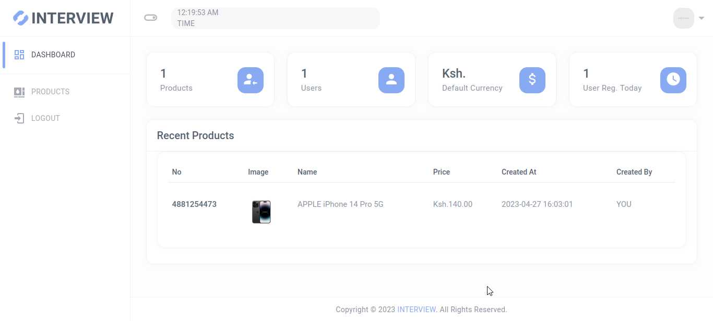
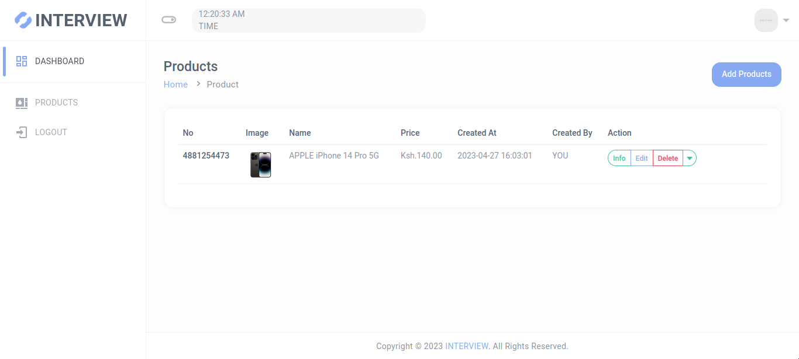
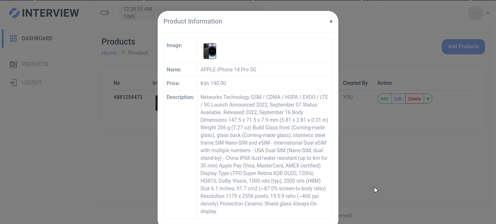
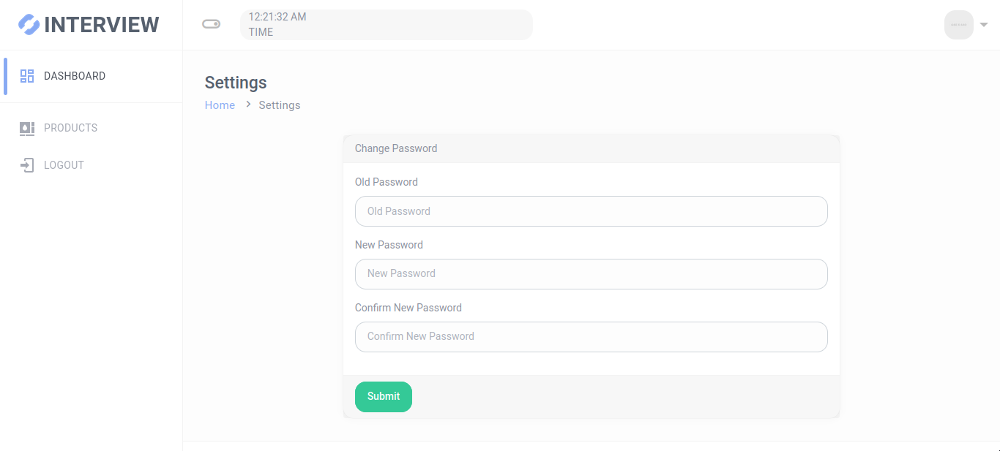
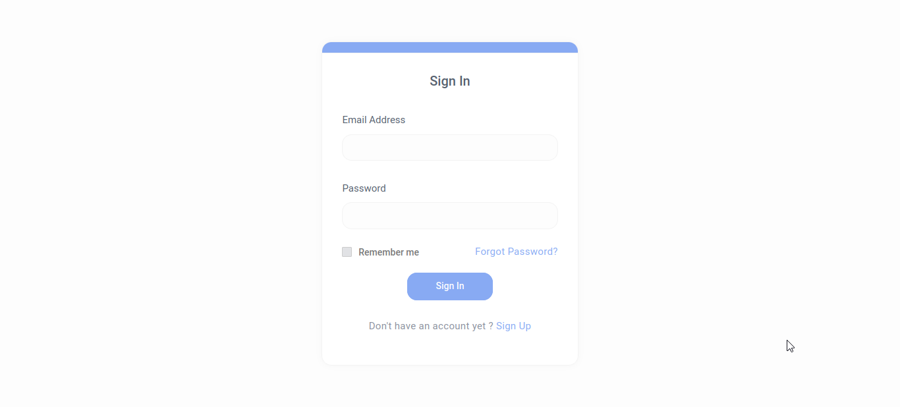

# Laravel 8 Boilerplate  Auth, Passport, Livewire,Helpers, Simple and User Friendly

## Features

    1. Laravel 8 Framework
    2. Laravel-Permission by middlewares
    3. Laravel Backup by spatie/laravel-backup
    5. Laravel Passport Authentication for API
    6. Products API
    7. Laravel Ajax CRUD using Livewire
    8. Bootstrap 4
    9.  Admin Template
    10. Authentication
    11. User Panel

### Requirements

    1. PHP version 8.2.2 and Above   
    2. Laravel version  9 

### Installation

    1. Clone the project using git clone   
    2. Copy a fresh .env file from laravel github    
    3. Update .env file by adding database information like DB_HOST.  
    4. Go to project root folder.Open git bash or terminal and run  composer install       
    5. Run php artisan key:generate in the terminal    
    6. import db.sql from db folder

         
    
### Troubleshootings
    
    1. Change Db port in config/database.php file or change as yours.
    2. Try composer composer dump-autoload if need
    3. php artisan config:cache if need
    4. php artisan clear-compiled if need    
    
### Note*
    
    Don't delete or edit already added permissions to avoid error   
    
         
### Login
        Create an account and use it for tests
         
         

         
## Credit

    1. Laravel 8 Framework
    2. Laravel Livewire
    3. Laravel Passport Authentication
    4. Bootstrap 4
        
Screenshot :    
  
   
   
   
   
 

 Find me on  My Profile  : [My profile  link](https://heinrichsmithdev.cf/)  \
 Email me : smithheinrich254@gmail.com